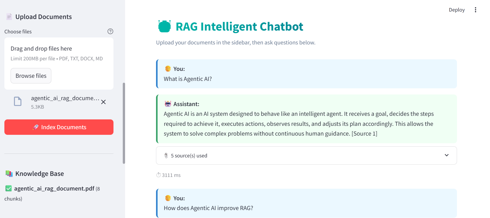
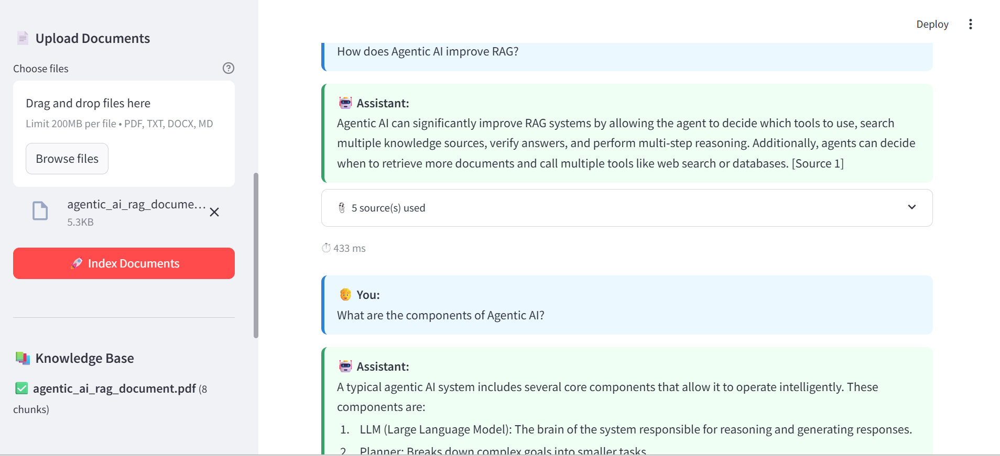
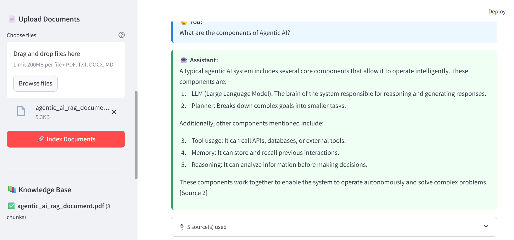

# 🤖 RAG Intelligent Chatbot

A production-ready Retrieval Augmented Generation (RAG) chatbot that lets you upload documents and ask questions about them. Built with Python, Streamlit, ChromaDB, SentenceTransformers, and the Groq LLM API.

---

## ✨ Features

| Feature | Details |
|---|---|
| 📄 Document Upload | PDF, DOCX, TXT, Markdown |
| 🧠 Semantic Search | SentenceTransformers `all-MiniLM-L6-v2` |
| 🗄️ Vector Store | ChromaDB with cosine similarity |
| ⚡ LLM Inference | Groq API (llama3-8b-8192 default) |
| 💬 Multi-turn Chat | Conversation history per session |
| 📎 Source Citations | Every answer cites source chunks |
| 🐳 Docker Ready | One-command deployment |

---

## 🏗️ Architecture

```
src/
├── ui/              ← Streamlit web application
├── embeddings/      ← SentenceTransformer wrapper + caching
├── vectordb/        ← ChromaDB vector store
├── retrieval/       ← Indexer · Retriever · RAGPipeline
├── llm/             ← Groq API client with retry logic
└── utils/           ← Models · Logger · TextSplitter · DocumentLoader
```

### Pipeline Flow

```
User Query
   │
   ▼
EmbeddingGenerator          ← embed query into dense vector
   │
   ▼
ChromaVectorStore.similarity_search()   ← top-k nearest chunks
   │
   ▼
Retriever.format_context()  ← concatenate chunks into context string
   │
   ▼
GroqLLMClient.generate()    ← system + context + history + query → answer
   │
   ▼
ChatResponse                ← answer + sources + latency
```

---

## 🚀 Quick Start

### 1. Clone & Install

```bash
https://github.com/21108130/rag_chatbot
cd rag-chatbot
make install
```

### 2. Configure

```bash
cp .env.example .env
# Edit .env and set your GROQ_API_KEY
```

Get a free Groq API key at → https://console.groq.com

### 3. Run

```bash
make run
# Opens http://localhost:8501
```

### 4. Use

1. Upload one or more documents in the **sidebar**
2. Wait for indexing to complete
3. Type your question in the chat input
4. Read the answer with source citations

---

## 🐳 Docker

```bash

make docker-run


docker-compose up --build
```

The app will be available at `http://localhost:8501`.

---

## 🧪 Tests

```bash

make test


make test-cov
```

Tests use mocking to avoid requiring real API keys or model downloads.

---

## ⚙️ Configuration

All settings are in `.env` (see `.env.example` for all options):

| Variable | Default | Description |
| --- | --- | --- |
| `GROQ_API_KEY` | — | **Required.** Groq API key |
| `LLM_MODEL` | `llama3-8b-8192` | Groq model name |
| `EMBEDDING_MODEL` | `all-MiniLM-L6-v2` | SentenceTransformer model |
| `TOP_K_RESULTS` | `5` | Chunks retrieved per query |
| `CHUNK_SIZE` | `512` | Max chars per chunk |
| `CHUNK_OVERLAP` | `50` | Overlap between chunks |
| `SIMILARITY_THRESHOLD` | `0.3` | Min score to include chunk |
| `LLM_TEMPERATURE` | `0.1` | LLM creativity (0=deterministic) |

---

## 📁 Project Structure

```
rag-chatbot/
├── src/
│   ├── ui/                    # Streamlit app
│   │   └── app.py
│   ├── embeddings/
│   │   └── embedder.py        # EmbeddingGenerator
│   ├── vectordb/
│   │   └── chroma_store.py    # ChromaVectorStore
│   ├── retrieval/
│   │   ├── indexer.py         # DocumentIndexer
│   │   ├── retriever.py       # Retriever
│   │   └── rag_pipeline.py    # RAGPipeline (orchestrator)
│   ├── llm/
│   │   └── groq_client.py     # GroqLLMClient
│   └── utils/
│       ├── models.py          # Pydantic data models
│       ├── logger.py          # Loguru logging
│       ├── text_splitter.py   # RecursiveTextSplitter
│       └── document_loader.py # DocumentLoader (PDF/DOCX/TXT/MD)
├── config/
│   └── settings.py            # Pydantic Settings (all config)
├── tests/
│   ├── conftest.py
│   ├── test_text_splitter.py
│   ├── test_models.py
│   ├── test_embedder.py
│   ├── test_chroma_store.py
│   └── test_rag_pipeline.py
├── data/
│   ├── uploads/               # Uploaded documents
│   └── chroma_db/             # Persisted vector DB
├── .env.example
├── requirements.txt
├── Dockerfile
├── docker-compose.yml
├── Makefile
└── pyproject.toml
```

---

## 🛠️ Development

```bash

make format


make lint


make clean
```

---






## 📄 License

MIT License — see [LICENSE](LICENSE) for details.
